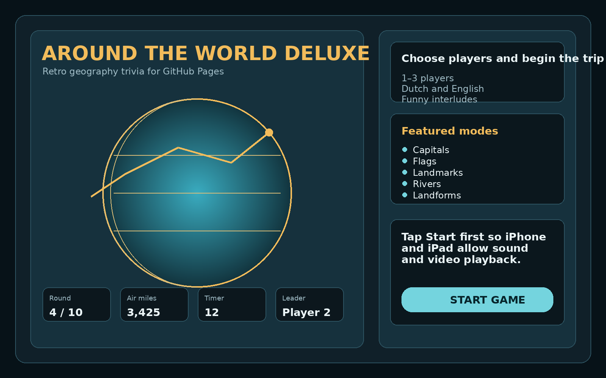
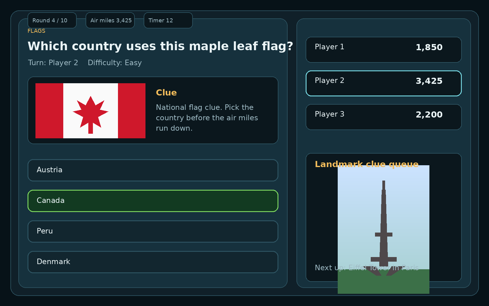
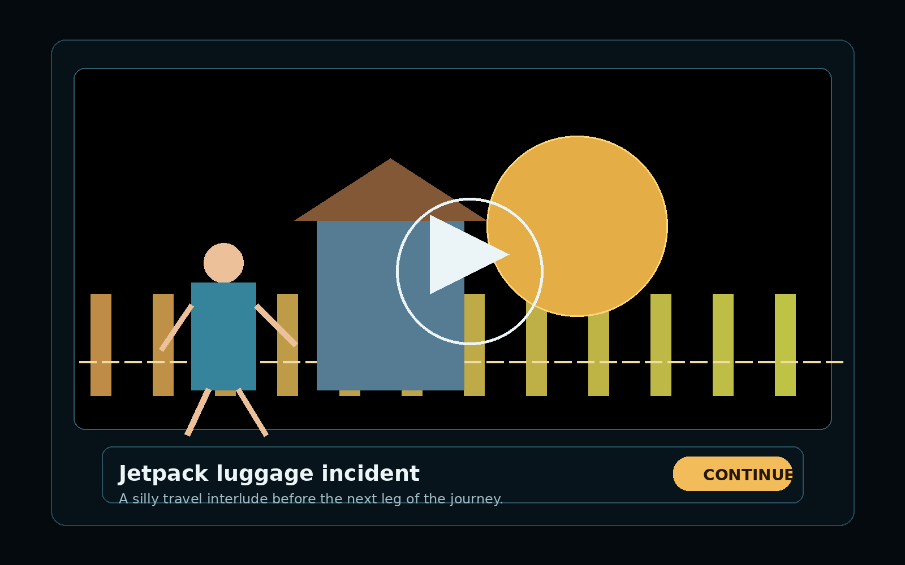

# Around the World Deluxe

Retro-inspired geography trivia game prepared as a polished GitHub Pages project.

## Live site structure

- `index.html` — landing page for GitHub visitors
- `game.html` — playable trivia game
- `.github/workflows/pages.yml` — optional GitHub Actions deployment workflow
- `.nojekyll` — disables Jekyll processing
- `assets/screenshots/` — place your own screenshots here

## Before publishing

Search and replace these placeholders:

- `pacorob`
- `Aroundtheworld`

Suggested repository name:

- `Aroundtheworld`

## Screenshots

Add your own screenshots in:

- `assets/screenshots/home-screen.png`
- `assets/screenshots/question-round.png`
- `assets/screenshots/interlude-video.png`

Example markdown once you add them:

```md



```

## Deploy with GitHub Pages

### Branch deploy

1. Create a new repository, for example `Aroundtheworld`.
2. Upload all files from this package to the repository root.
3. Go to **Settings > Pages**.
4. Choose **Deploy from a branch**.
5. Select your main branch and the root folder.
6. Save and wait for the site URL.

### GitHub Actions deploy

1. Push this package to your repository.
2. Go to **Settings > Pages**.
3. Set the source to **GitHub Actions**.
4. Push to `main` and let the included workflow publish the site.

## Customization ideas

- Change the repo name and links in `index.html`
- Replace demo interlude videos with your own licensed clips
- Add real screenshots for the landing page and README
- Add a custom domain later through GitHub Pages settings

## Notes

- The app uses relative paths to work cleanly on GitHub Pages project sites.
- The game is static and does not need a Node build step.
- External demo media and Wikimedia-hosted clue images are referenced by URL rather than bundled locally.
